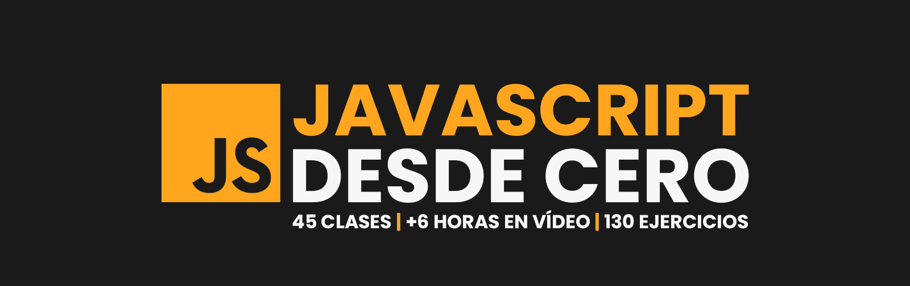

# 🟡 JavaScript desde cero - MoureDev
Este repositorio contiene los fundamentos desde cero del curso de javascript, realizado por MoureDev. El objetivo principal es demostrar los conocimientos y habilidades obtenidos sobre esta tecnología, mientras me mantengo en un proceso constante de aprendizaje.

- Creador del curso: [MoureDev](https://github.com/mouredev)

- Repositorio del curso:  [hello-javascript ](https://github.com/mouredev/hello-javascript)

